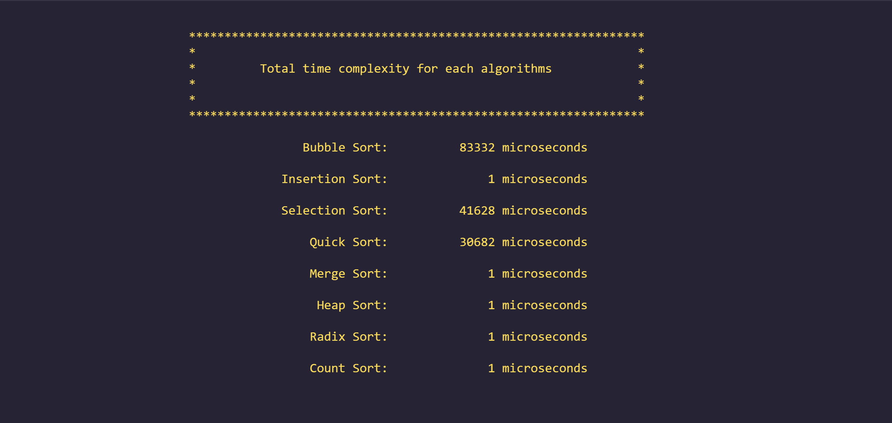
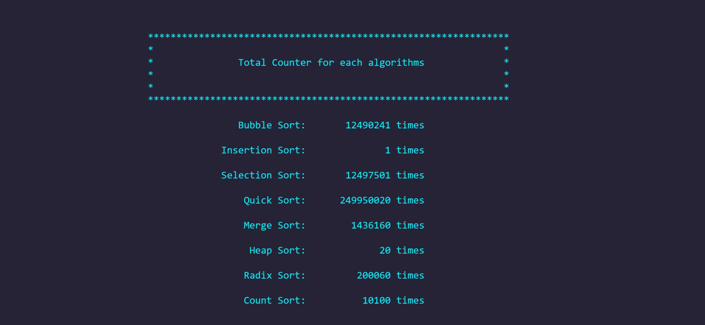
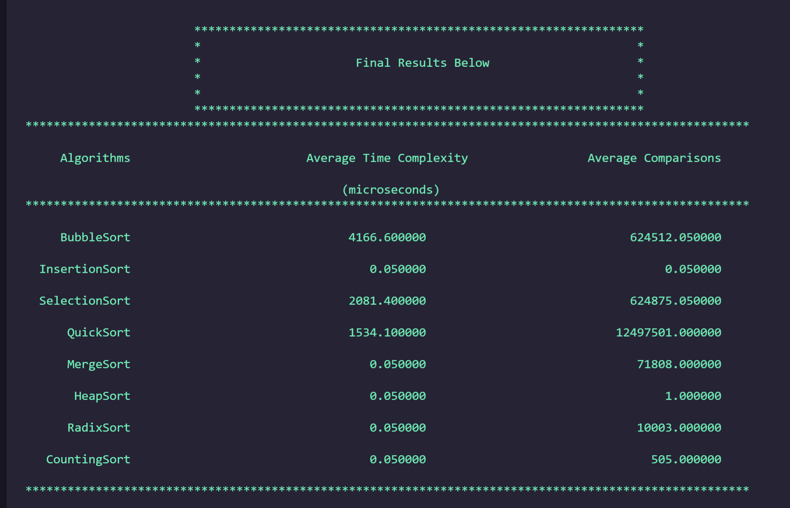

## Assignment 2 - Sort Comparisons

### Loic Konan

#### Description

- Implement at least 3 different sorting algorithms on arrays of **size 5000**.
- Sorting Algorithm from each runtime category: **O(n2), O(n log n), O(n)**.
- Implement a separate **counter for each sort**.
- **Use a system clock timer to start the time immediately** before each sort and end immediately after each sort.
- **Average the time and counter results over 20 iterations**, using a different random seed for each run.
- I used a function to fill the arrays with **random numbers From 0 to 1000.**

<h2 align="center"> Total time complexity for each algorithms </h2>

<h2 align="center"> Total Counter for each algorithms </h2>

<h2 align="center"> Final Results  </h2>

### Files

|   #   | File                                   | Description                                |
| :---: | -------------------------------------- | ------------------------------------------ |
|   1   | [main.cpp](main.cpp)                   | The main cpp with comments and description |
|   2   | [bubbleSort.hpp](bubbleSort.hpp)       | The bubble sort Algorithm                  |
|   3   | [copyArray.hpp](copyArray.hpp)         | Function to copy arrays                    |
|   4   | [insertionSort.hpp](insertionSort.hpp) | The insertion sort Algorithm               |
|   5   | [mergeSort.hpp](mergeSort.hpp)         | The merge sort Algorithm                   |
|   6   | [quickSort.hpp](quickSort.hpp)         | The quick sort Algorithm                   |
|   7   | [selectionSort.hpp](selectionSort.hpp) | The selection sort Algorithm               |
|   8   | [heapSort.hpp](heapSort.hpp)           | The Heap sort comparison Algorithm         |
|   9   | [header.hpp](header.hpp)               | The header file for the sorting algorithms |
|  10   | [countSort.hpp](countSort.hpp)         | The count sort Algorithm                   |
|  11   | [radixSort.hpp](radixSort.hpp)         | The radix sort Algorithm                   |
|  12   | [printArray.hpp](printArray.hpp)       | Prints the array                           |
|  13   | [termcolor.hpp](termcolor.hpp)         | Prints color                               |
|  14   | [fillArray.hpp](fillArray.hpp)         | Function to fill arrays                    |

### Instructions

- This program does not require any non standard libraries

### Example Command

- None for now.
